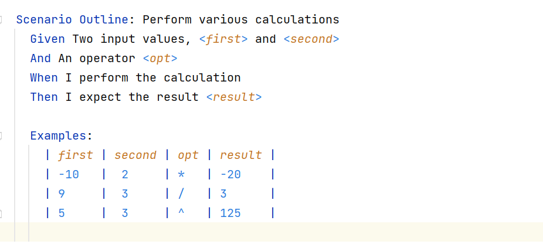
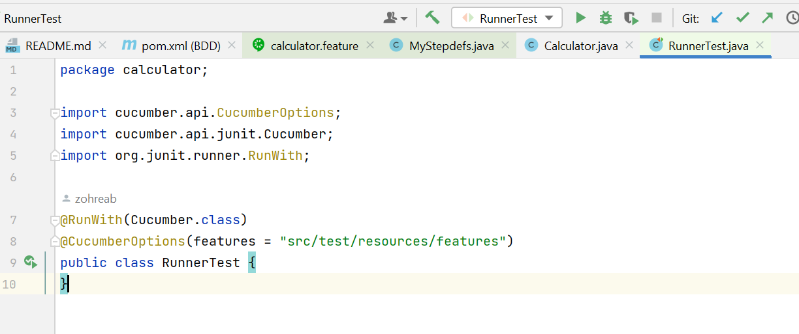

# آزمایشگاه مهندسی نرم‌افزار- آزمایش سوم
## پاسخ به سوالات مطرح‌شده در روال انجام آزمایش

در انتهای مستند، هنگام اجرای Scenario Outline، برخی تست‌ها به مشکل undefined برمی‌خورند:

-**این موارد تست کدامند؟** 

هنگام اجرای تست دوم که در آن عدد اول برابر با -1، عدد دوم برابر با 6 و نتیجه برابر با 5 است به مشکل می‌خوریم:

-**علت بروز این مشکل چیست؟**

 در فایل MYStepdefs.java حالتی در رجکس ورودی برای منفی بودن اعداد مطابق شکل زیر در نظر گرفته نشده است که با دادن ورودی منفی در تست به مشکل می‌خورد:

-**مشکل را با تغییر کد برطرف نمایید**.

 با عوض کردن Regex نشان‌داده شده در تصویر بالا و در نظر گرفتن حالتی که اعداد ورودی منفی باشند توانستیم تست را پاس کنیم:

پاس شدن تست‌ها:

## پیاده‌سازی ماشین‌حساب خواسته‌شده مطابق ساختار قسمت اول
### خواسته‌ی آزمایش

در این قسمت از ما خواسته شده است که ماشین‌حسابی با سه عملیات ضرب، تقسیم و توان بسازیم. ورودی مطابق خواسته‌ی آزمایش به صورت زیر است:

|first number||second number||operator|  

همچنین در فایل feature باید حتما هم سناریوی معمولا و هم سناریوی outline  در نظر گرفته شود.

### آماده‌سازی پروژه

**نکته: پس از کلون کردن ریپازیتوری و باز کردن پروژه در intellij idea  با پیامی مطابق شکل زیر مواجه می‌شوید که با اجرای load، قادر به run کردن فایل‌های پروژه خواهید بود.**

### شرح ساختار پروژه
ساختار پروژه به صورت زیر است که هر قسمت به صورت جداگانه توضیح داده می‌شود:

### فایل pom.xml
در این قسمت dependency های لازم که cucumber و  junit هستند به پروژه اضافه شده‌اند:

### کلاس Calculator 

این کلاس که عملیات‌های ماشین‌حساب در آن انجام می‌شوند شامل تابعی است که دو عدد و یک کاراکتر که همان operator است به عنوان ورودی می‌گیرد و با استفاده از یک switch-case روی operator ورودی تصمیم می‌گیرد که چه عملیاتی روی دو عدد انجام دهد و حاصل را خروجی بدهد. برای حالت تقسیم در نظر گرفته شده است که اگر عدد دوم صفر باشد با توجه به اینکه مخرج صفر تعریف نشده است ارور division by zero is not allowed داده شود. در حالتی که هیچ از یک از این سه operator به عنوان ورودی سوم داده نشوند هم ارور invalid operator داده می‌شود:

### فایل calculator.feature

در این فایل سناریوهای تست تعریف می‌شوند. ابتدا سه سناریوی عادی برای هر سه عملگر، تعریف شده که بیان می‌کنند با گرفتن دو عدد و عملگر انتظار چه خروجی‌ای می‌رود. با گرفتن 6 و 2 و عملگر ضرب انتظار خروجی 12 را داریم. با گرفتن 6 و 2 و عملگر تقسیم انتظار حاصل 3 را داریم و با گرفتن دو عدد 6 و 2 و عملگر توان انتظار حاصل 36 را به عنوان خروجی داریم:

سپس یک outline scenario هم برای هر سه عملگر تعریف می‌کنیم. می‌گوییم اگر دو مقدار first و second و opt به عنوان ورودی داده شوند انتظار چه resultای داریم و سپس جدول نمونه را تعریف می‌کنیم. 

### فایل MyStepdefs
در فایل باید برای هر استپ در سناریوهای فایل فیچر یک definition داشته باشیم. ابتدا ایمپورت‌های لازم را انجام داده و متغیرهای مورد نیاز را تعریف می‌کنیم:

سپس برای هر خط سناریو تعریفی ارائه می‌دهیم. در رجکس تمام حالات مثبت یا منفی بودن دو عدد را در تظر می‌گیریم

### فایل RunnerTest.java 

در این فایل تست‌های نوشته شده را ران می‌کنیم:

### نتایج ران کردن تست‌ها

پس از ران کردن می‌بینیم که تست‌ها به درستی پاس می‌شوند:

